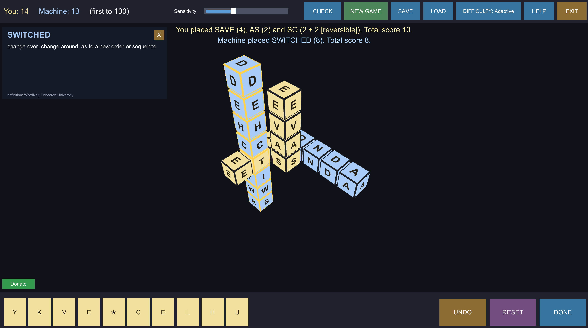
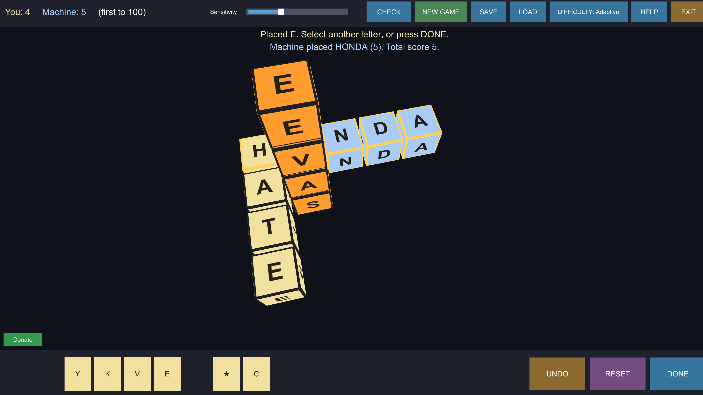

# CUBEZ

**A word game in three dimensions.** Build lines of lettered cubes through open
space to spell words, crossing through letters already placed — like a crossword
that grew a third axis. You play against the machine.

Made by [Wombyland](https://www.wombyland.com/). Windows, single player.

---

## Download

**[⬇ Get the latest release](../../releases/latest)**

| | |
|---|---|
| **Installer** — `CUBEZ-1.0.1-Setup.exe` | Recommended. Installs for the current user only, so it needs no administrator rights. Adds a Start menu entry and an optional desktop shortcut. |
| **Portable zip** — `CUBEZ-1.0.1-Windows.zip` | No installation. Unzip anywhere and run `CUBEZ.exe`. |

### Windows will warn you about this download

CUBEZ is not code-signed — certificates cost several hundred dollars a year,
which is difficult to justify for a free game. Windows SmartScreen will show
**"Windows protected your PC"** when you run the installer. Click **More info**,
then **Run anyway**.

This warning means Microsoft has not seen the file often enough to have formed an
opinion of it. It is not a virus report. Every release lists a SHA-256 checksum
you can compare against `Get-FileHash` in PowerShell.

**If Windows refuses outright, with no "Run anyway" option**, you have Smart App
Control switched on. That is stricter than SmartScreen and blocks unsigned
software rather than warning about it, with no per-application exception. The
portable zip sometimes passes where the installer does not.

---

## Requirements

| | |
|---|---|
| **Operating system** | Windows 10 or 11, 64-bit |
| **Disk space** | Roughly 100 MB installed |

The game runs full screen at 1920 × 1080.

---

## How it plays

Every cube carries a letter. You hold a tray of them along the bottom of the
screen, and you spend them building **straight lines through the play space** —
left–right, up–down, or front–back.

**It is a crossword, in the round.** Every word your move creates must be real,
not only the line you meant to build. If your new cubes sit alongside existing
ones and spell something invalid in a crossing direction, the move is rejected
and your cubes come back — so there is no cost to trying.

**Scoring is one point per letter**, whether you placed the cube this turn or it
was already on the board. A word that also reads validly **backwards** — PART and
TRAP, or a palindrome like LEVEL — earns **two bonus points**. One move often
makes several words at once, and each is scored.

**The wildcard** is a blank cube that can stand for any letter. You choose which
when you place it, and that choice is locked in for the rest of the game.

**Stuck with unusable letters?** **RESET** throws your tray away and deals a fresh
set, at the cost of your turn.

The machine plays against you at four difficulties — Easy, Medium, Hard and
Nightmare — which change how deep into the dictionary it is willing to reach.

---

## Controls

**Placing letters**

| Action | Control |
|---|---|
| Pick up a letter | Click a cube in your tray |
| Place it | Click a face of a cube on the board |
| Or, in one motion | Drag a letter straight from the tray onto the board |
| Rearrange your tray | Drag tiles within the tray, before placing your first cube |
| Take back the last cube | `UNDO` — press again to keep stepping back |
| Take back one cube | Right-click a cube you placed this turn |
| Score the move | `DONE` |

**Looking around**

| Action | Control |
|---|---|
| Orbit the play space | Drag empty space |
| Zoom | Mouse wheel |
| Spotlight a word | Right-click a placed cube — everything else fades |

The most recently played word, yours or the machine's, keeps a soft gold border
until the next one is played.

**Buttons**

`CHECK` opens a dictionary lookup — spell a word with your tray letters, with
letters on the board, or by typing, and it tells you instantly whether it counts
and what it means. Checking never costs you a turn.

`SAVE`, `DIFFICULTY`, `HELP` and `EXIT` sit along the top bar.

---

## The dictionary

CUBEZ uses a single word list of **172,822 entries**, drawn from the public-domain
ENABLE list including all inflected forms. The same file decides both what counts
as a word and how the machine ranks difficulty.

Definitions come from **WordNet**, Princeton University. When the machine plays a
word, a pop-up shows what it means — which turns out to be a good way to pick up
vocabulary while losing.

Full credits and licences are in **[ATTRIBUTION.md](ATTRIBUTION.md)**, which also
ships with the game.

---

## Tweaking it

The game reads `settings.cfg` from its `CUBEZ_Data\StreamingAssets` folder at
startup, so you can adjust it without rebuilding anything. Turning off the
machine's definition pop-ups, for instance, is `showMachineDefinitions=false`.
Open the file in any text editor; each setting is commented.

---

## Uninstalling

Installed with the installer: **Settings → Apps → Installed apps → CUBEZ →
Uninstall**. Used the zip: delete the folder.

Saved games and settings live in
`%UserProfile%\AppData\LocalLow\Wombyland\CUBEZ` and are left alone by the
uninstaller. Delete that folder by hand if you want them gone.

---

## Reporting a problem

Open an [issue](../../issues). What helps most: what you were doing, your Windows
version, and the log from
`%UserProfile%\AppData\LocalLow\Wombyland\CUBEZ\Player.log`.

---

## About

CUBEZ is one of several games at
**[wombyland.com](https://www.wombyland.com/)**, where it can also be played in a
browser.

This repository distributes the game only. It contains no source code — see
[LICENSE.txt](LICENSE.txt) for terms, and
[ATTRIBUTION.md](ATTRIBUTION.md) for third-party components.
